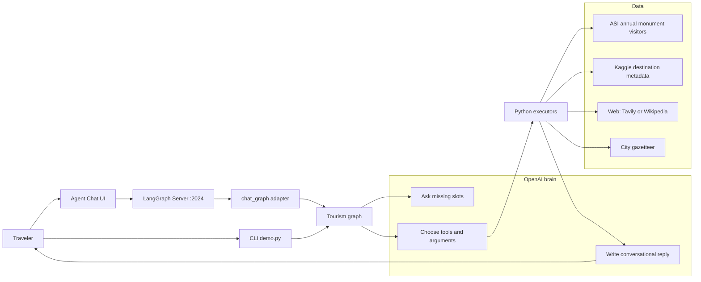
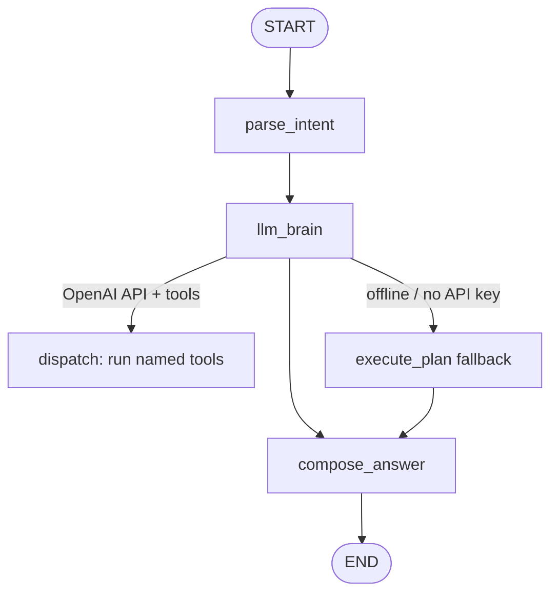
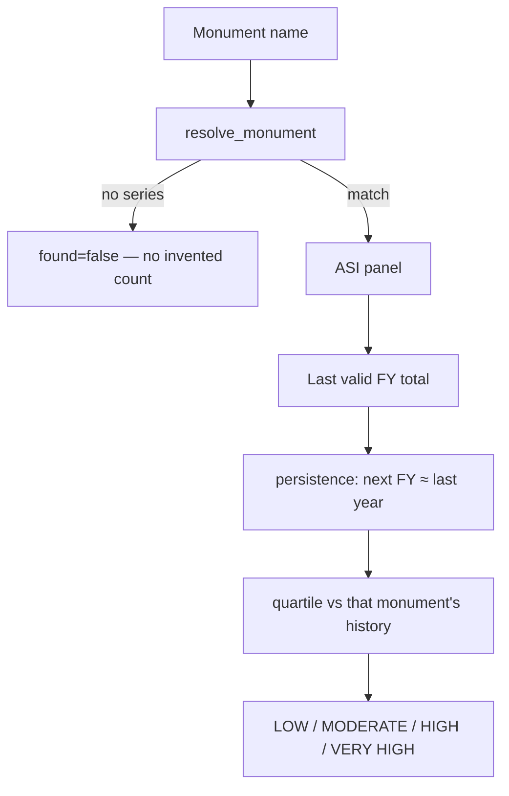
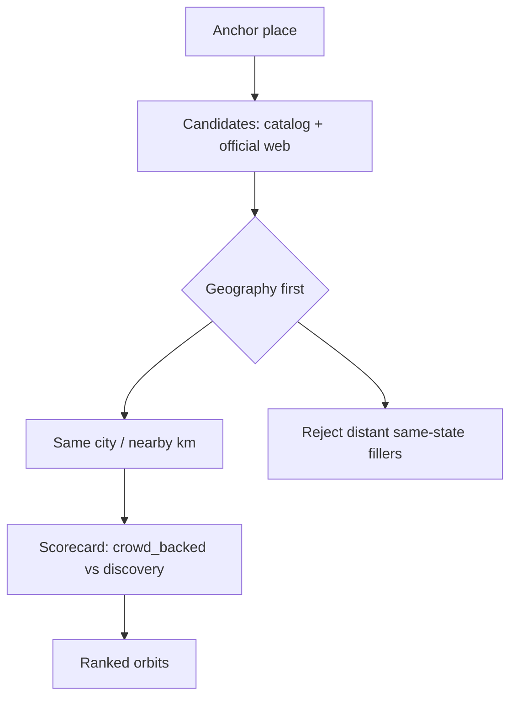

# PiedPiper — Tourism Crowd Intelligence

SIH 2026 decision-support agent for **Indian heritage tourism**.

A traveler talks in chat. The **OpenAI brain** interprets the trip, asks for missing details (place, dates, family / friends / solo), then **chooses tools**. Python only **runs** those tools against ASI + Kaggle data, official web search, geography filters, and ranking. The spoken reply is written by the model from **tool facts** — it does not invent visitor counts.

**Live crowd number (when an ASI monument series exists):** last observed financial-year total (**persistence**). Offline experiments (Ridge / RF / GB / a small MLP) lost to this baseline on chronological ASI splits, so they are **not** in the live path.


---

## What you get

| Traveler asks | What the system does |
|---|---|
| Where / when / with whom | Conversation: ask if slots are missing |
| How crowded is a monument? | ASI annual persistence + relative LOW–VERY HIGH (not occupancy %) |
| Will *my dates* be busier? | Heuristic window (weekends, holidays, season, events, weather) — **not** a new daily headcount |
| What else nearby? | Geography-first orbits (not “same state = nearby”), ranked with the existing scorecard |
| Plan the days | Sketch itinerary: must-visit anchors, then nearby orbits |

**Not supported:** hourly/daily occupancy, maps, Streamlit, treating Kaggle `Visitors_Count` as official ASI footfall.

---

## Architecture

### System context



### Runtime graph (live)

Chat UI talks to graph id **`tourism`** (`src/agent/chat_graph.py`). Each turn calls `run_agent()` — the same graph as the CLI.



**Brain decides:** interpret → catalog research (ASI/Kaggle) → web for gaps → whether research is enough → window pressure vs annual baseline → nearby recommendations if the **full research bundle** looks busy (not only annual HIGH) → conversational answer or a follow-up question.

### Crowd model (validated)



Web adjectives such as “popular” are **never** turned into a visitor total.

### Nearby places



---

## Project layout

```
PiedPiper/
├── demo.py                 # CLI
├── langgraph.json          # graph id tourism → chat adapter
├── destination_mapping.csv
├── data/
│   ├── raw/                # ASI + Kaggle (unchanged official prints)
│   └── processed/          # long panel + forecast tables
├── src/
│   ├── agent/             # LangGraph, brain, dispatch, compose
│   ├── predict.py         # persistence forecast
│   ├── tools_*.py          # catalog, web, period, recommend
│   ├── geo.py
│   └── nn_crowd_experiment.py / dataset_ablation.py  # offline only
├── tests/
└── reports/                # experiment metrics (why persistence won)
```

---

## Setup

Python **3.11+**. From the repo root:

```bash
python -m venv .venv
# Windows: .venv\Scripts\activate
# macOS/Linux: source .venv/bin/activate
python -m pip install -r requirements.txt
copy .env.example .env   # Windows
# cp .env.example .env   # macOS/Linux
```

Put `OPENAI_API_KEY` in `.env`. Optional: `TAVILY_API_KEY` for web search (otherwise Wikipedia OpenSearch).

**Never commit `.env`.**

---

## Run

### Tests

```bash
python -m unittest discover -s tests -q
```

### CLI

```bash
python demo.py --example taj_instead --verbose
python demo.py --interactive
```

### Chat UI

**Terminal 1 — API** (Windows if colored logs crash: `$env:LOG_COLOR='false'`):

```bash
langgraph dev --no-browser
```

- API: http://127.0.0.1:2024  
- Graph ID: `tourism`

**Browser — official Agent Chat UI:** [https://agentchat.vercel.app](https://agentchat.vercel.app)

- Deployment URL: `http://localhost:2024`
- Graph ID: `tourism`
- LangSmith API key: empty for local

Optional Studio: [https://smith.langchain.com/studio/?baseUrl=http://127.0.0.1:2024](https://smith.langchain.com/studio/?baseUrl=http://127.0.0.1:2024)

Start a **new chat thread** after restarting the server.

---

## Data notes

Official printed ASI counts in raw CSVs are **not overwritten**. Missing tokens are missing, not zero. Anomaly flags and COVID handling are described in [DATA_QUALITY_REPORT.md](DATA_QUALITY_REPORT.md).

Kaggle rows are **destination metadata** (type, season tags, etc.), not a substitute ASI headcount.

---

## Constraints (live path)

- Persistence is the only live visitor **MODEL OUTPUT**.
- Travel-window up/down is **HEURISTIC + web facts**, not a new daily total.
- Same Indian state ≠ nearby.
- Duplicate LangChain wrappers and old plan docs were removed; `src/agent/registry.py` + `dispatch.py` are the tool surface the brain calls.
